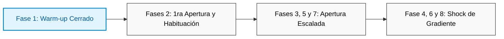

# Automated Age Verification Using Computer Vision
**Advanced Optimization Project for the "Good Seed" Supermarket Chain**

## Descripción del Proyecto

Este repositorio contiene el desarrollo de un sistema de visión artificial basado en Aprendizaje Profundo (*Deep Learning*) diseñado para la cadena de supermercados **Good Seed**. El objetivo principal es optimizar el cumplimiento de las regulaciones vigentes sobre la venta de productos restringidos (alcohol y tabaco), garantizando de forma automatizada y auditable que no se suministren estas mercancías a menores de edad.

El sistema simula un entorno de producción donde cámaras ubicadas en las cajas de autoservicio se activan dinámicamente al escanear un artículo restringido. El núcleo del software estima la edad cronológica del cliente en tiempo real a partir de una captura facial, sirviendo como filtro de seguridad y soporte para el personal del establecimiento.

---

## Desafíos Técnicos y de Negocio

El desarrollo del modelo requirió mitigar tres fenómenos críticos inherentes a los datos:

1. **Volumen de Datos Moderado:** Un inventario de **7,591 imágenes** (`faces/`) y un archivo de anotaciones (`labels.csv`), lo que representa un entorno reducido para entrenar redes profundas desde cero, elevando el riesgo de sobreajuste (*overfitting*).

2. **Desbalance Demográfico:** Una distribución natural sesgada hacia el rango de adultos jóvenes (20 a 40 años), reduciendo la densidad de muestras en los extremos de la población (niños y adultos mayores). *Una mejora significativa provendría de equilibrar el desvalance de edades, principalmente de aquellos que se busca blindar (15-21 años)*

3. **Ruido en Etiquetas:** La brecha natural entre la edad biológica percibida y la edad cronológica legal, lo que establece un piso mínimo de error insalvable debido a la subjetividad del rostro humano.

---

## Arquitectura de Software y Entorno (`tf_vision`)

Para garantizar la reproducibilidad matemática y mitigar conflictos de librerías, el proyecto se ejecutó de forma aislada dentro del entorno virtual especializado `tf_vision`. 

* **Infraestructura Base:** `tensorflow==2.15.0` y `keras==2.15.0`.

* **Aceleración de Hardware Local:** Integración nativa con procesadores Apple Silicon (arquitectura ARM/M-Series) mediante el plugin `tensorflow-metal==1.1.0`.

* **Optimización en Mac M1:** Uso mandatorio de la API `LegacyAdam` para estabilizar el flujo de gradientes en memoria unificada.

* **Componentes Científicos:** Respaldado por `numpy` para cómputo matricial, `pandas` para procesamiento analítico de metadatos, y `scikit-learn` para segmentación diagnóstica.

---

## Estrategia de Modelado: Fine-Tuning Progresivo Avanzado

En lugar de aplicar un entrenamiento plano tradicional o fuerza bruta, la investigación se estructuró a través de un algoritmo quirúrgico de **8 fases secuenciales** utilizando **Transfer Learning** sobre el backbone de **ResNet50** preentrenada en ImageNet:

1. **Calentamiento de la Cabeza (Warm-up):** Congelamiento total del backbone para alinear y calibrar los pesos aleatorios de la capa de salida lineal (activación ReLU) sin corromper las características abstractas originales de ImageNet.

2. **Liberación de capas:** Se liberan las últimas 5 capas convolucionales con un `LR` moderadamente elevado y con reducción dinámica para optimizar progresivamente los pesos de razgos más especializados.

3. **Descongelamiento Progresivo en Cascada:** Apertura escalonada de bloques convolucionales de atrás hacia adelante (15, 25 y 40 capas) acoplados con reducciones drásticas en el tamaño del paso del optimizador para habituación.

4. **Shock de Gradiente (Efecto Trampolín):** Tras detectar un estancamiento del modelo en un mínimo local plano, se aplicó una inyección controlada de energía cinética multiplicando la tasa de aprendizaje por 10 ($5\times10^{-5}$). Esta "patada" matemática desestabilizó la meseta y forzó al optimizador a buscar un cañón de pérdida global mucho más profundo, para finalmente asentarse con el enfriamiento del callback `ReduceLROnPlateau`.

---

## Resultados y Métricas de Calidad

El proyecto concluyó con un rendimiento sobresaliente, pulverizando los muros de calidad definidos originalmente para la tarea de regresión continua:

* **Métrica Objetivo Obligatoria del Negocio:** $MAE \le 8.0$ años.
* **Récord Final Alcanzado:** **`6.7512` años de Error Absoluto Medio (`val_mae`)** en validación.
* **Categoría del Proyecto:** Clasificado bajo el estándar de **Nivel Destacado de Investigación**.

Para evitar la hiperespecialización masiva de los pesos libres (considerando que el entrenamiento descendió a un $MAE = 2.09$), se incorporó una capa de regularización estocástica por **Dropout al 30%** inmediatamente antes de la neurona de salida, garantizando una robusta capacidad de generalización ante rostros completamente nuevos.

---

## Viabilidad e Impacto de Negocio

Con un margen de error promedio inferior a los 7 años, el modelo posee la madurez estadística requerida para su despliegue operativo en el piso de venta mediante la siguiente política:

* **Regla de Seguridad Automatizada:** Si el modelo estima una edad **inferior a los 28 años**, el sistema bloquea preventivamente la pantalla de pago y solicita una validación de identificación humana obligatoria.

* **Retorno de Inversión (ROI):**

    * * **Protección Legal:** Brinda un blindaje corporativo total contra penalizaciones legales o pérdida de licencias comerciales por la venta inadvertida a menores de edad.

    * **Eficiencia Operativa:** El software automatiza y agiliza el flujo de compra para la gran mayoría de los usuarios visiblemente adultos, descongestionando el área de cajas y mejorando la experiencia del cliente.
