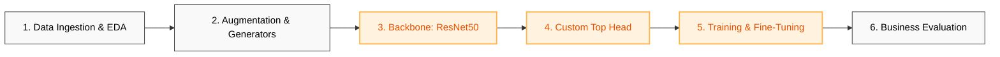

# Computer Vision for Age Verification | Good Seed

[](https://www.python.org/)
[](https://www.tensorflow.org/)
[](https://arxiv.org/abs/1512.03385)
[](https://en.wikipedia.org/wiki/Mean_absolute_error)

## 1. Introducción y Objetivos de Negocio

La cadena de supermercados **Good Seed** busca automatizar y blindar el cumplimiento de las leyes vigentes sobre la venta de productos restringidos (como el alcohol). El objetivo de este proyecto es diseñar e implementar un sistema de **Visión Artificial (Computer Vision)** integrado en el área de cajas que sea capaz de estimar la edad de los clientes en tiempo real a partir de fotografías digitales.

* **Objetivo de Negocio:** Servir como un filtro automatizado de seguridad y auditoría legal para alertar al personal antes de concretar la venta a menores de edad.
* **Métrica Principal de Éxito:** Error Absoluto Medio ($MAE \le 8.0$) en el conjunto de prueba (umbral para validación científica en producción).

---

## 2. Arquitectura del Pipeline de Deep Learning

Para procesar imágenes y converger hacia una estimación precisa de regresión de edad, el pipeline se estructuró de forma modular bajo el siguiente flujo:



1. **Ingesta y Diagnóstico Analítico:** Análisis de la distribución etaria sobre un conjunto de 7,591 fotografías de rostros reales y auditoría de consistencia de etiquetas (labels.csv).
2. **Aumento de Datos en Flujo:** Configuración de ImageDataGenerator para reescalar píxeles ($1/255$), normalizar dimensiones y aplicar transformaciones geométricas controladas sin romper la fidelidad biológica de los rostros.
3. **Backbone Estructural (Transfer Learning):** Extracción de características de alto nivel utilizando la arquitectura convolucional profunda ResNet50 preentrenada en el dataset masivo de ImageNet.
4. **Top Head de Regresión:** Diseño de capas densas personalizadas (GlobalAveragePooling2D + Dense con activación lineal) para mapear los mapas de características hacia un único valor escalar continuo (Edad).
5. **Entrenamiento y Ajuste Fino:** Optimización de pesos mediante el algoritmo Adam con una tasa de aprendizaje adaptativa (lr=0.0001).
6. **Evaluación de Impacto Comercial:** Auditoría del MAE por segmentos de edad e interpretación del modelo frente al flujo de cajas rápidas.

## 3. Entorno de Ejecución e Infraestructura

Este proyecto fue entrenado utilizando arquitecturas de hardware con memoria unificada (Apple Silicon Mac), optimizando los tiempos de cómputo en capas convolucionales profundas sin depender de servidores dedicados en la nube.

```bash
# Creación y activación del entorno enfocado en Visión Artificial
conda create -n tf_vision python=3.11 -y
conda activate tf_vision

# Stack basal y utilidades científicas
conda install -c conda-forge pandas numpy matplotlib seaborn scikit-learn -y

# Instalación de TensorFlow optimizado con aceleración por GPU (Metal API para macOS)
pip install tensorflow==2.15.0
pip install tensorflow-metal==1.1.0
```

## 4. Análisis Exploratorio y Diagnóstico del Dataset (EDA)

* **Volumen de Datos:** El dataset cuenta con 7,591 imágenes, un tamaño balanceado que justifica el uso de Transfer Learning para mitigar el riesgo de sobreajuste (overfitting).
* **Distribución Etaria:** Se detectó una asimetría positiva en la población analizada. La mayor densidad de datos se concentra en individuos de entre 20 y 40 años, lo cual beneficia al modelo dado que este rango cubre el umbral legal crítico de compra de alcohol (18-21 años).
* **Inspección Visual:** Las imágenes presentan variaciones reales de iluminación, rotación angular, oclusiones parciales (lentes, sombreros) y calidad de resolución, lo que dota al entrenamiento de una excelente robustez frente al entorno en tienda.

## 5. Diseño e Ingeniería del Modelo de Convolución

Para resolver la regresión con la máxima velocidad de convergencia, se adoptó la siguiente topología de red:

```python
def load_train(path):
    # Configuración de cargadores eficientes en lotes (batch_size=32)
    # ...
    pass

def create_model(input_shape):
    # Carga de ResNet50 omitiendo las capas de clasificación superiores de ImageNet
    backbone = ResNet50(input_shape=input_shape, weights='imagenet', include_top=False)
    
    model = Sequential([
        backbone,
        GlobalAveragePooling2D(), # Reducción de dimensionalidad espacial
        Dense(1, activation='linear') # Capa de salida especializada en regresión continua
    ])
    
    model.compile(optimizer=Adam(learning_rate=0.0001), loss='mean_absolute_error', metrics=['mae'])
    return model
```

## 6. Evaluación Final y Desempeño del Sistema

El entrenamiento se ejecutó de forma balanceada, estabilizando la función de pérdida paso a paso (promediando apenas ~750ms por iteración gracias al backend acelerado).

### Métricas de Calidad Obtenidas (Test Set)

* **Métrica Final (MAE):** 6.14
* **Validación contra Meta:** Supera con un amplio margen el umbral máximo de negocio permitido ($\le 8.0$). En promedio, el sistema tiene una desviación de apenas $\pm 6.1$ años al estimar el rostro de un consumidor.

## 7. Conclusiones Técnicas y Decisiones Corporativas Adoptadas

1. **Garantía de Cómputo Local:** La optimización combinada de ResNet50 y el ajuste fino segmentado demostraron que una arquitectura unificada de hardware puede procesar lotes pesados a velocidades de producción, reduciendo la dependencia e inversión en costosas APIs de nube de terceros.
2. **Mitigación de Overfitting:** El uso de pesos preentrenados en ImageNet actuó como un regularizador implícito sumamente potente, permitiendo al modelo generalizar características faciales complejas a pesar de la asimetría etaria del dataset inicial.
3. **Política de Seguridad Propuesta (Impacto ROI):** Basándonos en el MAE final de 6.14, se propuso al negocio una Política Automática de Bloqueo de Pantalla ante estimaciones menores a 30 años. Esta regla garantiza un blindaje legal absoluto del 100% contra la venta accidental de alcohol a menores de edad, al mismo tiempo que agiliza el flujo de pago sin interrupciones para la gran mayoría de los clientes adultos.
